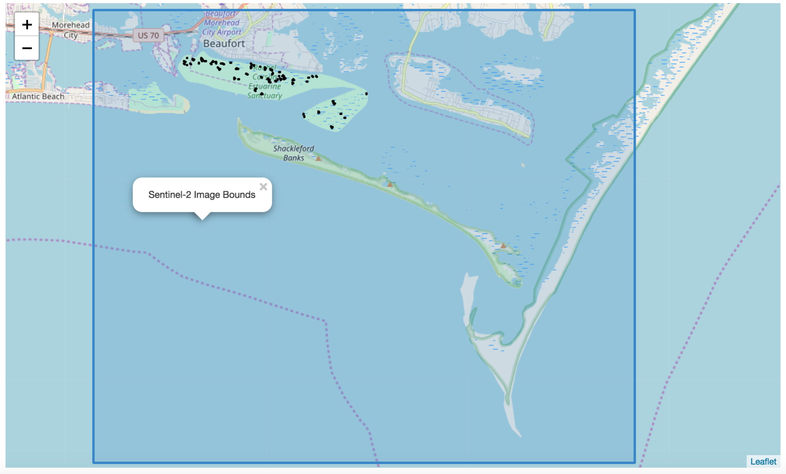
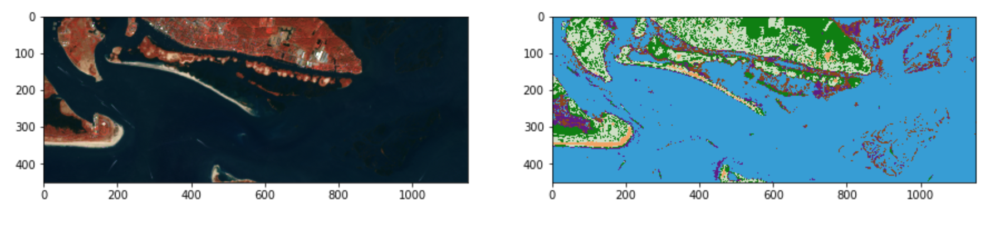

Open Source Geoprocessing Tutorial
==================================

<a rel="license" href="http://creativecommons.org/licenses/by-sa/4.0/">

</a><br />
<span xmlns:dct="http://purl.org/dc/terms/" property="dct:title"></a>

Tutorial of basic remote sensing and GIS methodologies using modern open source
software in Python (rasterio, shapely, GeoPandas, folium, etc). Notebooks cover raster processing, vector analysis, and a workflow to perform image classification using machine learning classifiers in `scikit-learn`:

All chapters are available as jupyter notebooks in the notebooks/ directory or viewable via a normal web browser in HTML:

0. Introduction
   [[HTML](http://patrickgray.me/open-geo-tutorial/chapter_0_introduction.html)]
1. The GDAL datatypes and objects
   [[HTML](http://patrickgray.me/open-geo-tutorial/chapter_1_GDALDataset.html)]
2. Your first vegetation index
   [[HTML](http://patrickgray.me/open-geo-tutorial/chapter_2_indices.html)]
3. Visualizing data
   [[HTML](http://patrickgray.me/open-geo-tutorial/chapter_3_visualization.html)]
4. Vector data - the OGR library
   [[HTML](http://patrickgray.me/open-geo-tutorial/chapter_4_vector.html)]
5. Land cover classification
   [[HTML](http://patrickgray.me/open-geo-tutorial/chapter_5_classification.html)]
6. More to come!!!

I strongly recommend using docker and downloading the notebooks so you can play as you read along, otherwise you will quickly forget these tools.

### Some of the things you'll learn:

#### Raster Operations, Processing, and Visualization


#### Interactive Shapefile and Raster Visualization
 

#### Machine Learning based Satellite Image Classification


# Download

Materials and data for these lessons are included inside this repository under
the `data` folder. I would recommend downloading all of the lesson material
at once, instead of downloading individual files.

Two ways to download the entire repository include:

* Use `git` to `clone` the repository (recommended)
    * [Instructions](https://help.github.com/articles/cloning-a-repository/)
* Downloading and extracting a ZIP file of the 'master' branch
    * [Download link](https://github.com/patrickcgray/open-geo-tutorial/archive/master.zip)

# Python Installation

To run the Jupyter Notebooks (formerly known as IPython Notebooks) and follow
the tutorial locally, you will need to install Python and the libraries used in
the tutorials. This installation can be accomplished in many ways, but I will
list the two most common approaches:

### conda

No matter what setup you have I recommend using the [Anaconda](http://conda.pydata.org/docs/) Python
distribution to make installation of the tutorial dependencies less complicated.
After [installing Anaconda or "miniconda" by following their
instructions](http://conda.pydata.org/docs/install/quick.html), you can install
the dependencies as follows:

``` bash
conda env create -f environment.yml
source activate open-geo-tutorial
```

### docker - recommended method

I highly recommend trying out [Docker](https://docs.docker.com/get-started/) if you're not familiar with it. There is a bit of a startup time just for getting up to speed but it is the way to go for reproducible work. Docker provides operating-system-level virtualization, also known as "containerization" and thus you can be sure that your setup precisely replicates the one used here and will easily run everything. Once you've downloaded Docker you can simply cd into the cloned git repo and run: 

`docker build -t open-geo .` 

which will pull the Dockerfile from the current location and create an OS image called 'open-geo' from it and then to create the container run this from the top of the git repo: 

`docker run --name geo-cont -p 8888:8888 -v "$PWD:/opt/notebooks" -it open-geo` 

which will start a container called 'geo-cont' based on the 'open-geo' image, then it will mount the repo directory to the container's /opt/notebooks directory where you can go access this repo's jupyter notebooks.
